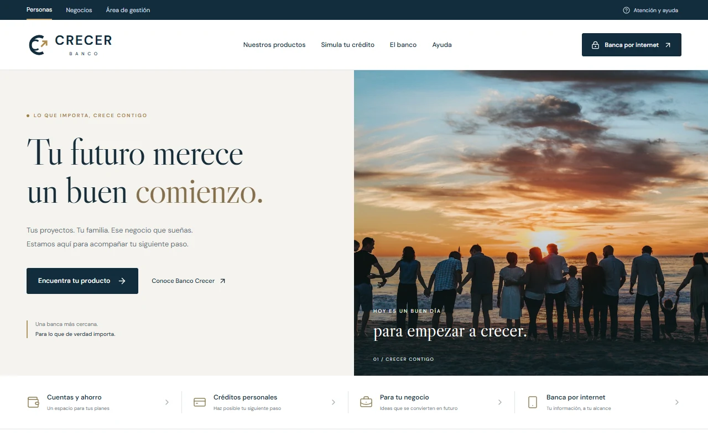
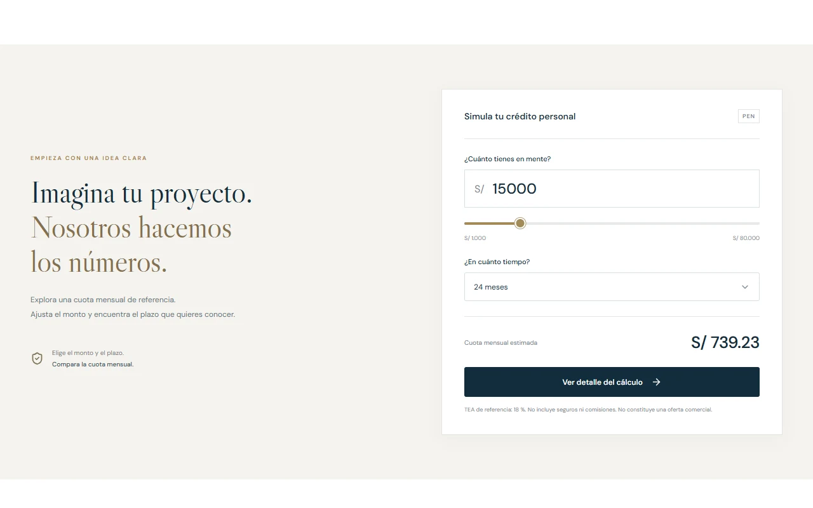
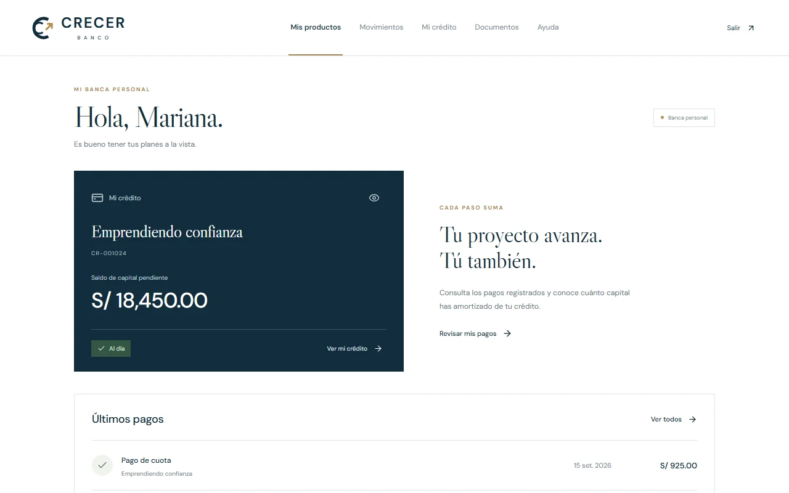
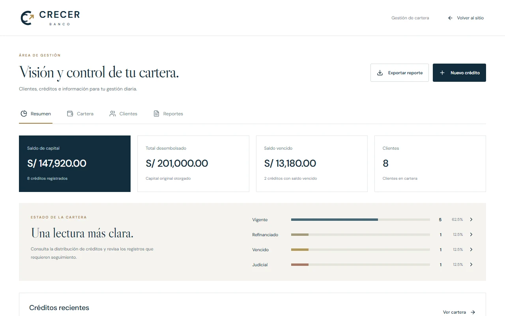

# Banco Crecer

**Una experiencia digital de banca, de principio a fin.**

Sitio institucional, banca personal y gestión de cartera en una misma aplicación. Una interfaz en español con identidad visual propia, componentes React personalizados y una navegación adaptada a cada experiencia.

[](https://github.com/AnalizaJech/Banco-Crecer/actions/workflows/deploy.yml)


[Explorar el sitio](https://analizajech.github.io/Banco-Crecer/) · [Banca personal](https://analizajech.github.io/Banco-Crecer/#acceso) · [Área de gestión](https://analizajech.github.io/Banco-Crecer/#gestion) · [Sistema de diseño](DESIGN_SYSTEM.md)



## Recorrido del producto

El siguiente GIF muestra la aplicación publicada: selección de plazo, detalle del cálculo, acceso a la banca personal y filtrado de créditos en gestión.


## Tres experiencias, una identidad

| Experiencia | Funciones principales |
| --- | --- |
| **Sitio institucional** | Seis productos, propuesta del banco, negocios, canales digitales, seguridad, educación financiera y preguntas frecuentes. |
| **Banca personal** | Resumen de crédito, capital pendiente, pagos registrados, movimientos por periodo, documentos y descargas CSV. |
| **Gestión de cartera** | Indicadores, distribución por estado, búsqueda de créditos y clientes, filtros, ordenación, altas, edición y reportes CSV. |

### Simulador de crédito

El monto y el plazo actualizan la cuota mensual estimada. El detalle presenta las condiciones del cálculo y el importe total. El selector de plazo y el deslizador mantienen el lenguaje visual de la marca.



### Banca personal

La vista de Mariana Torres reúne su crédito, saldo de capital y últimos pagos. La navegación superior organiza productos, movimientos, crédito, documentos y ayuda.



### Gestión de cartera

El resumen presenta capital, desembolsos, saldos vencidos y clientes. La cartera permite consultar cada registro, modificar sus datos y descargar reportes. Los cambios del crédito de Mariana se reflejan también en su banca personal.



### Experiencia móvil

Los contenidos se reorganizan en una columna. El menú, los desplegables y las ventanas se adaptan al ancho disponible, con foco visible y soporte para teclado.


## Tecnología y diseño

| Tecnología | Uso |
| --- | --- |
| **React 19 + TypeScript** | Componentes, estado de la interfaz y modelos de datos. |
| **Vite 8** | Desarrollo local y compilación de producción. |
| **Radix UI** | Selectores, ventanas, acordeones, deslizador y popover con interacción por teclado. |
| **React DayPicker** | Calendario personalizado en español. |
| **Lucide React** | Iconografía consistente. |
| **CSS** | Diseño adaptable, estados de interacción y movimiento reducido. |
| **GitHub Actions + Pages** | Compilación y publicación automática. |

La identidad combina azul profundo, oro y fondos marfil. **Libre Caslon Display** aporta carácter a los títulos; **DM Sans** facilita la lectura de navegación, formularios y cifras. El logotipo y el favicon son vectoriales. Las decisiones visuales se documentan en [DESIGN_SYSTEM.md](DESIGN_SYSTEM.md).

## Desarrollo local

**Requisito:** Node.js 22.14 o superior, con npm.

```sh
git clone https://github.com/AnalizaJech/Banco-Crecer.git
cd Banco-Crecer
npm ci
npm run dev
```

Abre la dirección que indica Vite y añade la ruta `/Banco-Crecer/`.

| Comando | Resultado |
| --- | --- |
| `npm run dev` | Inicia el servidor de desarrollo. |
| `npm run build` | Comprueba TypeScript y genera la aplicación en `dist/`. |
| `npm run preview` | Permite revisar la compilación de producción localmente. |

## Estructura del proyecto

```text
Banco-Crecer/
├── src/
│   ├── main.tsx          # Sitio público, acceso y banca personal
│   ├── Admin.tsx         # Gestión de cartera, clientes y reportes
│   ├── ExtraSections.tsx # Canales, seguridad y educación financiera
│   ├── ui.tsx            # Componentes compartidos de la interfaz
│   ├── data.ts           # Modelos y registros de referencia
│   ├── portfolio.ts      # Persistencia local y exportación CSV
│   └── styles.css        # Identidad visual y estilos adaptables
├── public/               # Logotipo, favicon y fotografía
├── docs/images/          # Capturas y recorrido animado
├── .github/workflows/    # Publicación con GitHub Actions
└── DESIGN_SYSTEM.md      # Guía del sistema visual
```

## Navegación y datos

| Ruta | Destino |
| --- | --- |
| `#inicio` | Sitio institucional. |
| `#simulador` | Calculadora de crédito. |
| `#negocios` | Propuesta para negocios. |
| `#acceso` | Entrada a la banca personal. |
| `#banca` | Banca personal después de entrar desde acceso. |
| `#gestion` | Área administrativa. |

Para explorar la banca, abre **Banca por internet → Entrar a mi banca**. No se solicitan credenciales. La sesión se mantiene en memoria y termina al recargar la página.

Los registros creados o editados se guardan en `localStorage`, con la clave `crecer-portfolio-v1`, y permanecen en ese navegador. La exportación CSV permite conservar una copia; los registros no se sincronizan entre dispositivos.

## Publicación

La configuración de Vite utiliza la base `/Banco-Crecer/`. Cada actualización de `master` ejecuta el [flujo de publicación](.github/workflows/deploy.yml): instala las dependencias, comprueba TypeScript, compila y despliega `dist/` en GitHub Pages.

Para reproducir el despliegue en un fork, configura **Settings → Pages → Source → GitHub Actions** y ajusta la base de Vite si cambia el nombre del repositorio.

## Alcance del proyecto

Banco Crecer es una muestra de producto frontend con datos ficticios. No representa una entidad bancaria operativa ni procesa aperturas, pagos o transferencias reales. El simulador utiliza una TEA de referencia del 18 %, sin seguros ni comisiones.

Gestión no incorpora autenticación ni control de acceso. No deben almacenarse datos personales reales. Una implementación operativa requiere un backend con autenticación, autorización, auditoría y persistencia protegida.

## Autoría y recursos

Proyecto desarrollado por **[Analiza Jech](https://github.com/AnalizaJech)** como trabajo freelance para **Lisset Yataco Tasayco**, clienta del proyecto.

- **Marca:** símbolo, logotipo y favicon propios en SVG.
- **Fotografía:** [recurso original de Unsplash](https://images.unsplash.com/photo-1511895426328-dc8714191300), almacenado localmente.
- **Tipografía:** DM Sans y Libre Caslon Display, servidas mediante Google Fonts.
- **Material visual del README:** capturas de la aplicación publicada, en escritorio y móvil; GIF de sus estados de navegación.
